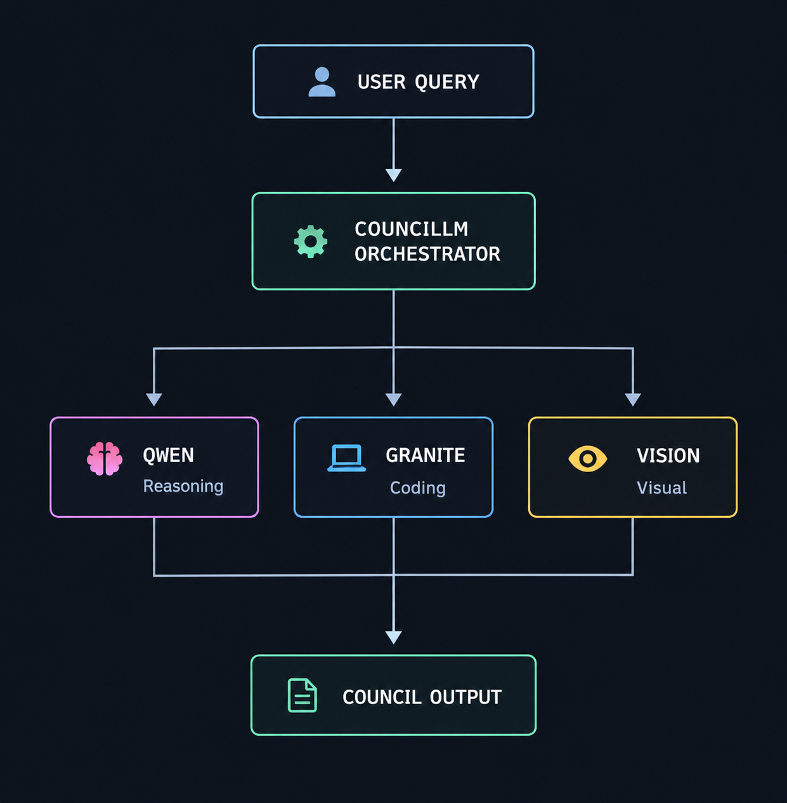
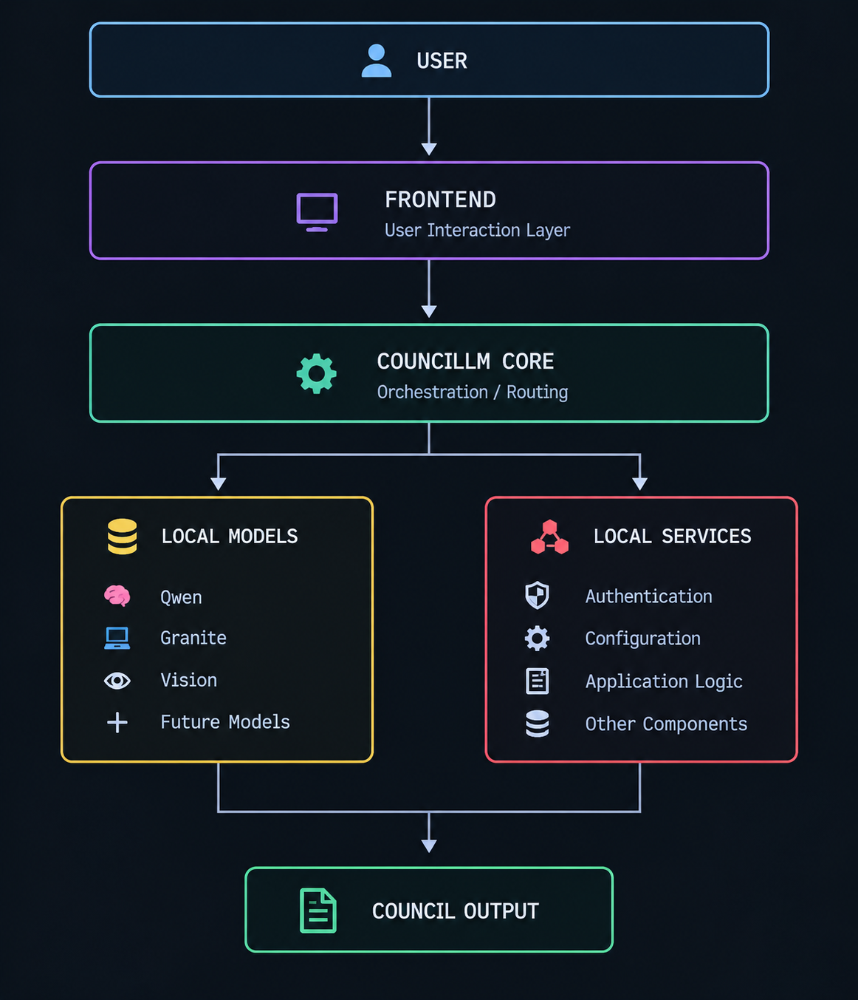
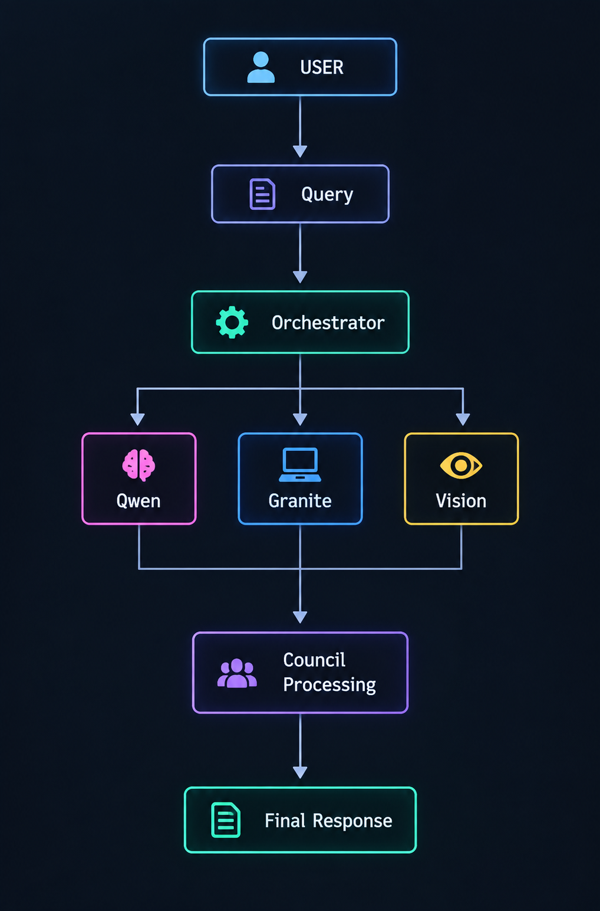
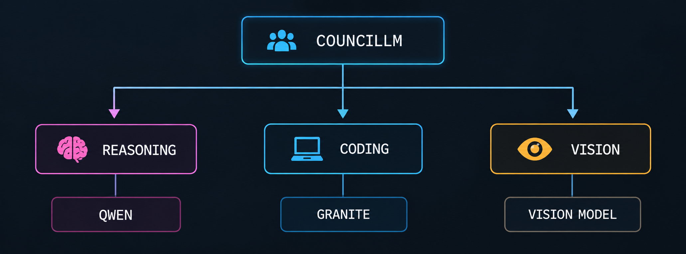
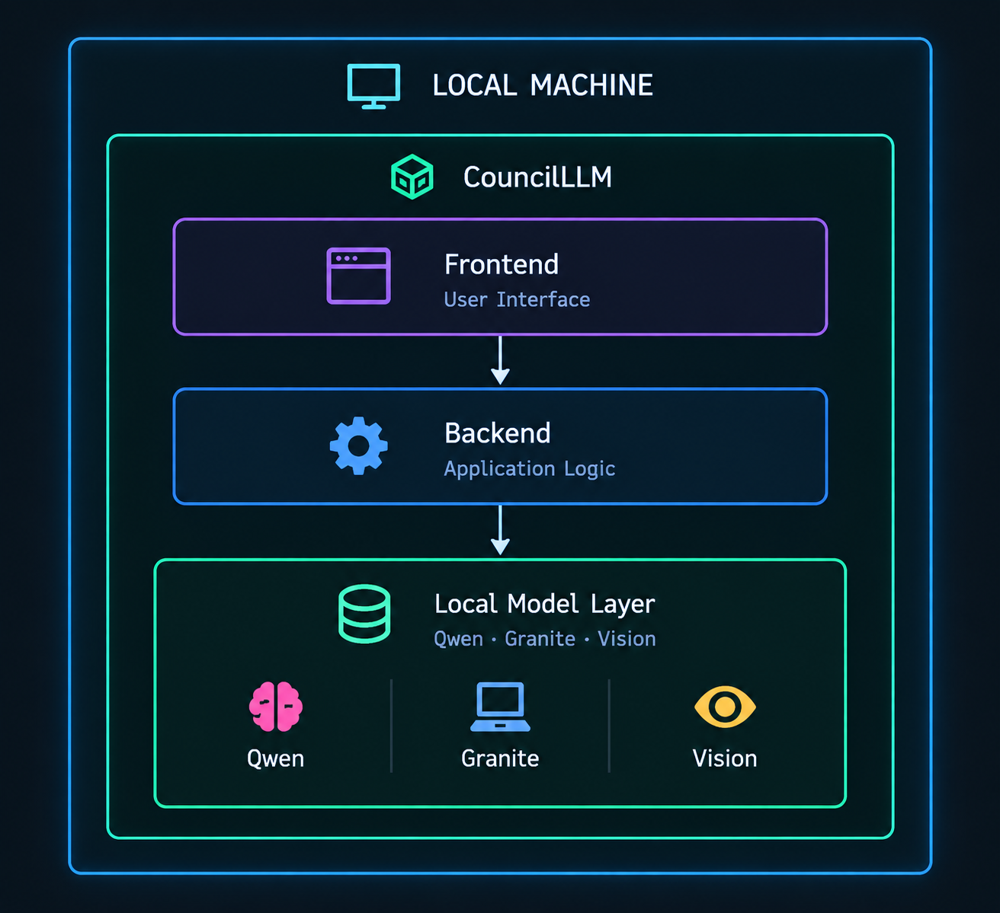
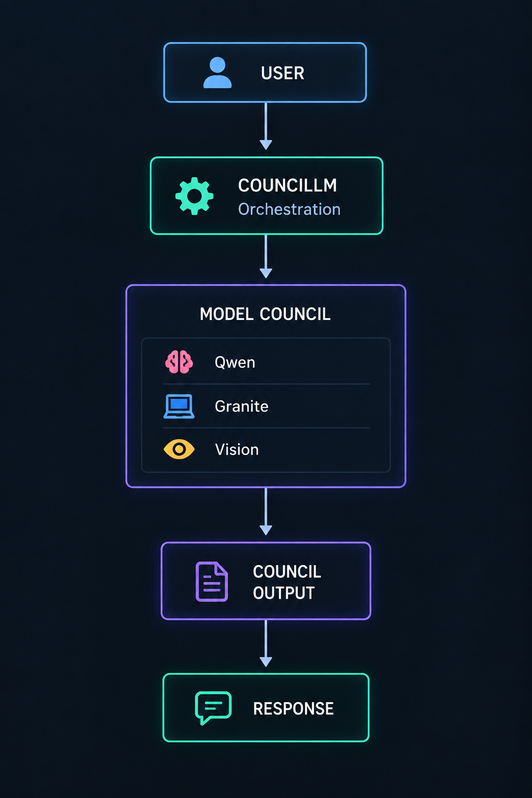
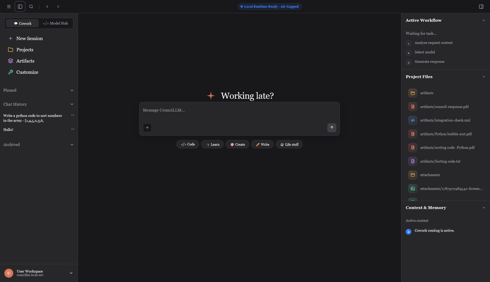
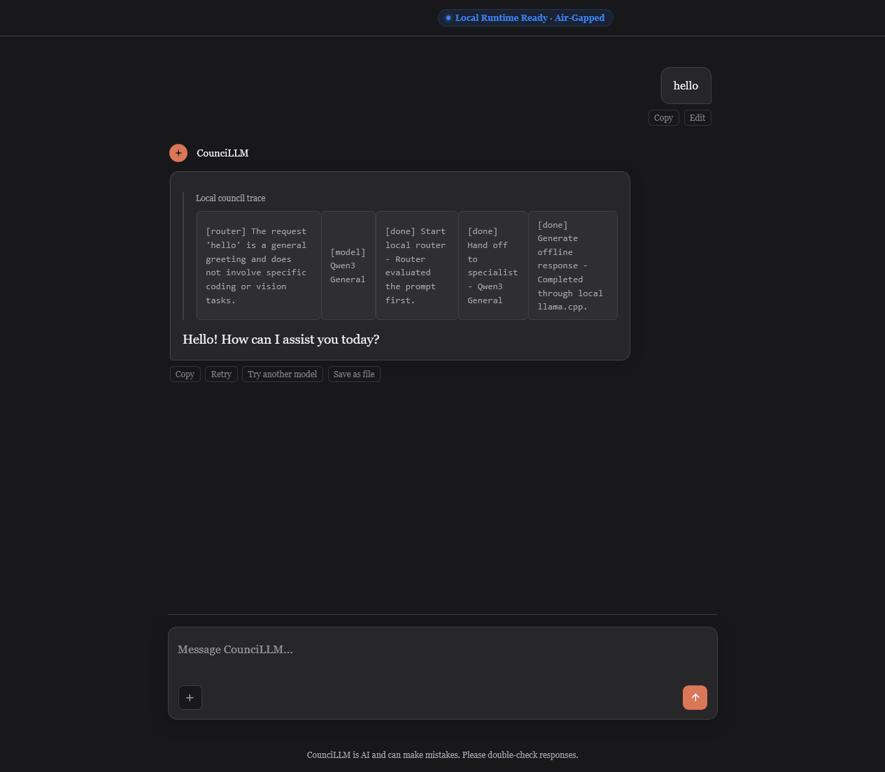

<div align="center">

# 🧠 CounciLLM

### An Offline Multi-Model AI Council

**Multiple models. Specialized roles. One local intelligence layer.**

<br>

<p>
  
  
  
  
</p>

<br>



<br>

<p>
  <a href="#-what-is-councillm">About</a> ·
  <a href="#-architecture">Architecture</a> ·
  <a href="#-the-model-council">Models</a> ·
  <a href="#-screenshots">Screenshots</a> ·
  <a href="#-roadmap">Roadmap</a>
</p>

</div>

---

## 🧠 What is CounciLLM?

**CounciLLM** is an offline, multi-model AI system built around the concept of an **AI council**.

Instead of expecting one model to handle every kind of task, CounciLLM organizes locally available models around **specialized responsibilities**.

A general reasoning model can focus on reasoning, a coding-focused model can handle programming tasks, and a vision model can work with visual information. The CounciLLM orchestration layer coordinates these components as part of a single local AI environment.

The project is designed with **local execution, modularity, and user control** at its core.

---

## ✦ The Idea

> **One model doesn't have to do everything.**

CounciLLM treats its models as members of a council rather than as interchangeable workers.

Each member has a defined role:

- 🧠 **Qwen** → General reasoning and interaction
- 💻 **Granite** → Coding and programming tasks
- 👁️ **Vision** → Visual understanding

This role-based approach provides a clear structure for combining different local model capabilities within one system.

---

# ✨ Features

| | Capability | Description |
|:---:|:---|:---|
| 🧠 | **Multi-Model AI** | Orchestrates multiple locally available models within one system. |
| 🎯 | **Specialized Roles** | Assigns models specific responsibilities according to their intended purpose. |
| 💻 | **Coding Intelligence** | Uses Granite specifically for coding-oriented tasks. |
| 👁️ | **Visual Intelligence** | Uses a dedicated vision model for visual understanding. |
| 🔒 | **Privacy-Oriented** | Designed to keep the core AI workflow within the local environment. |
| 🏠 | **Offline-First** | Built around local model execution rather than cloud inference as the foundation. |
| 🧩 | **Modular Design** | Separates orchestration, models, and application components so the system can evolve. |
| 👤 | **Local Authentication** | Uses a local account model with password authentication and recovery codes. |

---

# 🏛️ Architecture

CounciLLM is organized into several logical layers:

1. **Frontend** — the user-facing interaction layer.
2. **CounciLLM Core** — the orchestration and routing layer.
3. **Local Models** — locally available AI models assigned to their respective roles.
4. **Local Services** — supporting components such as authentication, configuration, and application logic.
5. **Council Output** — the resulting output returned to the user.



---

## 🔄 Request Flow

A typical request follows the general flow below:



The orchestrator acts as the bridge between the user's request and the appropriate members of the model council.

---

# 🤖 The Model Council

CounciLLM organizes its local models around distinct responsibilities.

| Model | Role | Primary Responsibility |
|:---|:---:|:---|
| 🧠 **Qwen** | Reasoning | General-purpose reasoning and interaction |
| 💻 **Granite** | Coding | Programming and coding-oriented tasks |
| 👁️ **Vision** | Visual | Visual understanding and image-related tasks |



### Why specialization?

The council does not require every model to perform every task.

Instead, each model can focus on the responsibility assigned to it. This makes the architecture easier to understand and provides a straightforward way to introduce additional models or roles as the project evolves.

---

# 🔒 Offline by Design

CounciLLM is designed around a **local-first, air-gapped-oriented architecture**.

The core idea is to keep the application, orchestration layer, and model execution within the local machine rather than making an external AI service the foundation of the system.



### Local-first principles

- 🏠 Local model execution
- 🔒 Privacy-oriented architecture
- 🧩 Modular local components
- 👤 Local authentication
- ⚙️ Local configuration
- 💾 Local application environment

---

# 👤 Local Authentication

CounciLLM follows a simple local authentication model designed for an offline environment.

| Component | Purpose |
|:---|:---|
| 👤 **Username** | Identifies the local account |
| 🔑 **Password** | Authenticates the account |
| 🧾 **Recovery Code** | Provides account recovery |
| 💻 **One Device / One Account** | Defines the intended local account model |

Account recovery uses a **generated recovery code** rather than security questions.

---

# 🔄 Council Processing

The overall interaction can be viewed as a pipeline:



The exact internal processing can evolve as the council orchestration layer develops, while the core principle remains the same: **route work to the appropriate local model and bring the workflow back together into a usable result.**

---

# 🖥️ Screenshots

## Main Interface



## Model Interaction



---

# ⚙️ How It Works

At a high level:


The important part is the separation of responsibilities. CounciLLM is not simply about running several models. It is about **organizing different local capabilities into one coherent workflow**.

---

# 🧩 Project Structure

The repository currently includes the documentation and visual assets used to describe CounciLLM. The implementation structure may continue to evolve during development.

```text
CounciLLM/
│
├── assets/
│   ├── 01-councillm-concept.png
│   ├── 02-system-architecture.png
│   ├── 03-request-flow.png
│   ├── 04-model-council.png
│   ├── 05-offline-architecture.png
│   ├── result-flow.png
│   │
│   └── screenshot/
│       ├── main-interface.png
│       └── model-interaction.png
│
├── README.md
└── ...
```

---

# 🛠️ Technology

CounciLLM is built around a local AI application architecture combining:

| Layer | Purpose |
|:---|:---|
| 🖥️ **Frontend** | User interaction and application interface |
| ⚙️ **Backend** | Application and orchestration logic |
| 🧠 **Local LLMs** | Language reasoning |
| 💻 **Granite** | Coding tasks |
| 👁️ **Vision Model** | Visual understanding |
| 🏠 **Local Runtime** | Local model execution and application operation |

The implementation stack can evolve as the project develops.

---

# 🚀 Getting Started

CounciLLM is currently an evolving project.

The repository contains the project's architecture, local model workflow, interface, and supporting components. Installation and runtime instructions will be documented here as the project reaches a stable release configuration.

> **Development note:** The exact models, model runtime configuration, hardware requirements, and startup procedure depend on the current development build.

---

# 🗺️ Roadmap

CounciLLM is actively evolving.

### Foundation

- [x] 🧠 Local multi-model architecture
- [x] 🎯 Model-specific responsibilities
- [x] 🏠 Local model execution
- [x] 🖥️ Local frontend/backend architecture
- [x] 👤 Local authentication concept
- [x] 🧾 Recovery-code based account recovery

### Future Development

- [ ] 🏛️ Improve council orchestration
- [ ] 🔄 Refine response processing
- [ ] 🤖 Expand supported model roles
- [ ] 👁️ Expand visual capabilities
- [ ] ⚙️ Improve model configuration
- [ ] 🧪 Expand automated testing
- [ ] 📚 Expand technical documentation
- [ ] 🎨 Continue refining the user interface

---

# 🎯 Design Philosophy

### 🏠 Local First

Keep the core AI workflow local.

### 🎯 Specialized Intelligence

Give each model a clear responsibility instead of requiring every model to do everything.

### 🧩 Modularity

Keep components replaceable and extensible as the project grows.

### 🔒 User Control

Keep the local AI environment, models, and application under the user's control.

### ⚡ Practicality

Multiple models should have a purpose. The council exists to organize useful capabilities, not simply to increase the number of models.

---

# 🤝 Contributing

CounciLLM is an evolving project, and contributions are welcome.

If you want to contribute:

1. Fork the repository.
2. Create a branch for your change.
3. Make your changes.
4. Test locally.
5. Open a pull request with a clear description.

For larger architectural changes, explain the reasoning behind the change and how it fits into the existing council architecture.

---

# 📜 License

This project is currently under active development. License information will be added here when the project license is finalized.

---

# 🙏 Acknowledgements

CounciLLM builds upon the broader ecosystem of open-source AI models and local inference technologies.

Individual model licenses and terms remain applicable to the models used with CounciLLM.

---

<div align="center">

## 🧠 CounciLLM

**Multiple models. Specialized roles. One local intelligence layer.**

<br>

<sub>Built for local AI experimentation, orchestration, and research.</sub>

</div>
